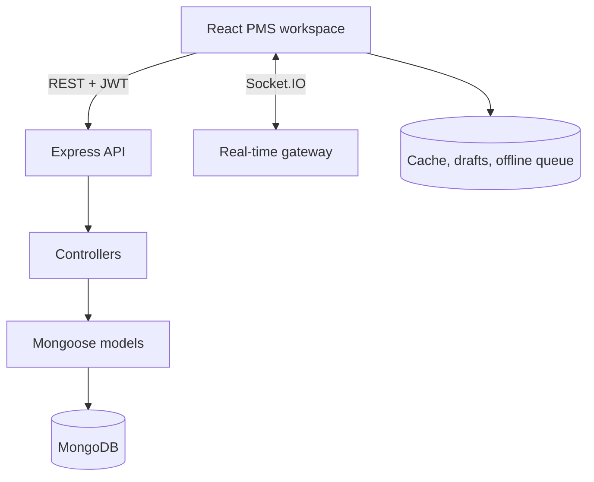

# PMS — Project Management SyncBoard

PMS is a complete real-time project and task management system built for the supplied group-project brief. It combines a responsive React workspace, a protected Express REST API, MongoDB persistence, JWT authentication, Socket.IO synchronization, offline task support, concurrent-edit protection, tests, CI, Docker, and deployment configuration.

## Demo access

| Portal | URL | Username | Password |
| --- | --- | --- | --- |
| Member workspace | `/login` | `login@pms` | `pms@123` |
| Administrator panel | `/admin/login` | `admin@login` | `admin@123` |

The application creates these accounts, a PMS implementation project, five specialist team members, and example tasks when it starts with an empty database. Change the demo passwords before exposing a production deployment.

## Completed functions

### Member workspace

- Login, refresh-session handling, protected routes, registration, profile editing, and logout
- Home overview with personal work, deadlines, team status, recent activity, and quick actions
- Dashboard with total, assigned, ongoing, done, overdue, average progress, priority, category, and personal-work charts
- Real-time Kanban board with Assigned, Ongoing, and Done stages and drag-and-drop movement
- Task list with search and status, priority, category, member, and project filters
- Add/edit/delete tasks with title, description, assignee, status, progress, priority, category, due date, tags, and comments
- Member cards with name, username, email, board role, project role, department, progress, online presence, and last seen time
- Reports with project totals, member performance, detailed task records, and CSV export
- Live activity-based notifications and offline/synchronization notices
- Administrator request submission and decision history
- Settings for dark mode, compact mode, reduced motion, and notification preferences
- Responsive layouts for desktop, tablet, and mobile

### Administrator panel

- Dedicated `/admin/login` entry point and separate administrator navigation
- Dashboard with account, board, task, completion, workflow, request, and recent-activity totals
- Project task list, full task editing, comments, deletion, and dedicated Add Task page
- Member/account management with role and active-state controls
- Project reports and CSV export
- Request approval, rejection, response, and reopening
- Administrator settings and logout

### Platform and engineering

- React component-based client with reusable contexts, pages, forms, tables, modals, charts, and task components
- Express routes/controllers/models separation
- MongoDB persistence through Mongoose
- JWT access tokens and rotating HTTP-only refresh cookies
- Task snapshot cache, task-form drafts, and an ordered offline mutation queue in `localStorage`
- Optimistic concurrency through `revision`; stale changes return HTTP `409` with the newest task
- Socket.IO board/task/activity/presence delivery between connected clients
- Jest + React Testing Library client tests and Jest + Supertest server tests
- GitHub Actions CI with a MongoDB service, tests, coverage, and production build
- Multi-stage Docker image, Docker Compose, health check, and Render blueprint

## Architecture



## Quick start with Docker

```bash
cp .env.example .env
docker compose up --build
```

Open `http://localhost:8080`. MongoDB data is kept in the `pms_mongo` volume.

## Local development

Requirements: Node.js 20.19+ and MongoDB 7+.

```bash
cp .env.example .env
npm install
npm run dev
```

The React client runs at `http://localhost:5173`; Vite proxies API and WebSocket traffic to the API at `http://localhost:8080`.

## Test and build

```bash
TEST_MONGO_URI=mongodb://127.0.0.1:27017/pms_test npm test
npm run build
```

Without `TEST_MONGO_URI`, database integration tests are skipped while HTTP boundary tests and all client tests still run. CI supplies MongoDB and runs the full suite.

## Production values

- `MONGO_URI`
- `JWT_ACCESS_SECRET` (random, 32+ characters)
- `JWT_REFRESH_SECRET` (different random value, 32+ characters)
- `ADMIN_NAME`, `ADMIN_USERNAME`, `ADMIN_EMAIL`, `ADMIN_PASSWORD`
- `MEMBER_NAME`, `MEMBER_USERNAME`, `MEMBER_EMAIL`, `MEMBER_PASSWORD`

## Documentation

- [REST API contract](docs/API.md)
- [MongoDB schema](docs/SCHEMA.md)
- [Real-time, offline, and concurrency design](docs/REALTIME-CONCURRENCY.md)
- [Deployment checklist](docs/DEPLOYMENT.md)
- [Team reflection](TEAM-REFLECTION.md)

## Known limitations

- Attachments and external email delivery are outside the supplied brief.
- Offline queuing covers task mutations; board membership and administrator actions require a live connection.
- Socket.IO uses the in-process adapter. A multi-instance deployment should add the official Redis adapter.
