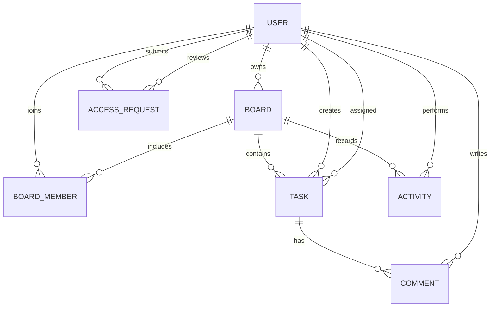

# PMS MongoDB Schema

## Collections

| Collection | Key information |
| --- | --- |
| `users` | Name, username, email, password hash, system role, project job title, department, progress, active state, avatar, refresh-token hashes, last seen, timestamps |
| `boards` | Title, description, color, owner, embedded members and board roles, archived state, timestamps |
| `tasks` | Board, title, description, stored status, progress, priority, category, assignee, creator, due date, tags, position, revision, offline `clientId`, embedded comments, timestamps |
| `activities` | Board, actor, action, target, summary, metadata, timestamp |
| `accessrequests` | Requester, request type, subject, message, status, response, reviewer, review time, timestamps |

Board membership and task comments are embedded because they are bounded and normally read with their parent. Users are referenced from boards, tasks, comments, activities, and requests so identity updates have one authoritative source.

Indexes cover unique username/email, member board lookup, task board/status/position lookup, activity chronology, request status/chronology, and task `clientId` replay protection.
